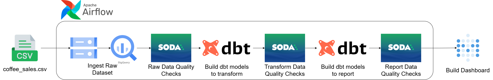
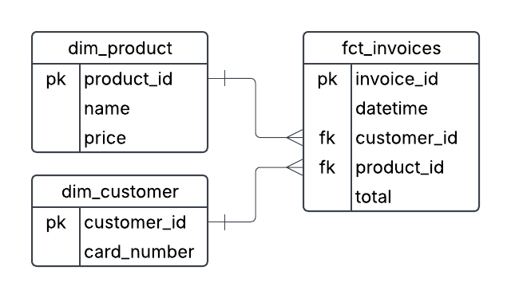
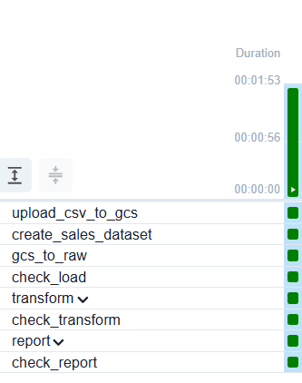
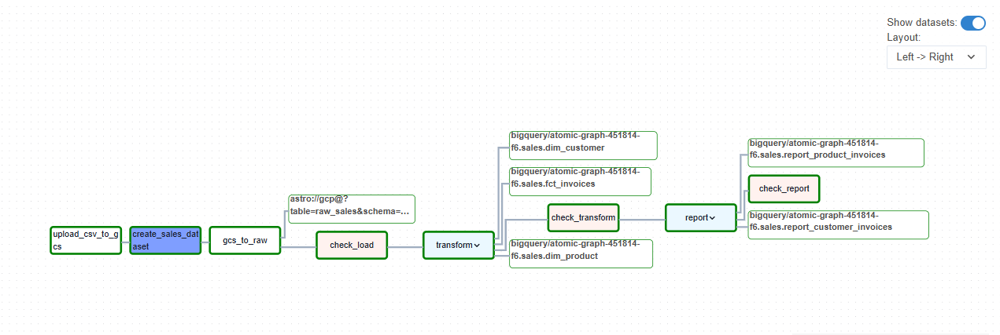
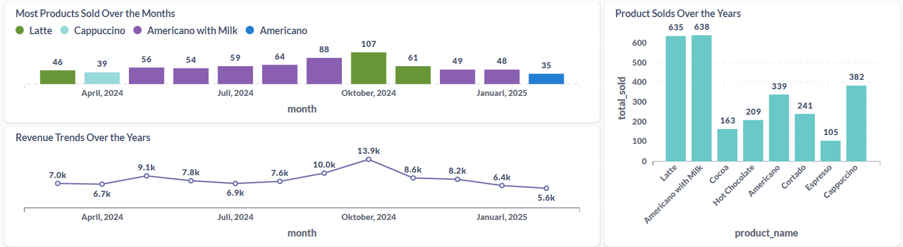

# End-To-End Data Engineer Coffee Sales Project

### This project aims to build an ETL (Extract, Transform, Load) pipeline to process coffee sales data and create a dashboard for analysis.

### Source Dataset : [Kaggle - Coffee Sales Dataset](https://www.kaggle.com/datasets/ihelon/coffee-sales)

### Tech Stack & Tools Used
#### ETL Pipeline
<ul>
  <li>Apache Airflow (Astro CLI) – For orchestrating data workflows.</li>
  <li>DBT – For transformations.</li>
  <li>BIGQUERY – As the data warehouse to store processed data.</li>
  <li>SODA - For data quality checks.</li>
</ul>

#### Data Visualization
<ul>
  <li>Metabase – For creating interactive dashboards and insights.</li>
</ul>

#### Infrastructure & Deployment
<ul>
  <li>Docker – To containerize and manage the ETL pipeline.</li>
  <li>Google Cloud Storage – For storing raw or intermediate data.</li>
</ul>

---

  
Pipeline

  

 

  
Data Modeling

  

## Pipeline

### Setup the docker with Astro CLI

  <figure>
    <figcaption><b>Bash</b></figcaption>

    astro dev init
    astro dev start
  </figure>

### Ingest Raw Dataset
  <figure>
    <figcaption><b>Python</b></figcaption>

    upload_csv_to_gcs = LocalFilesystemToGCSOperator(
        task_id = "upload_csv_to_gcs",
        src="/usr/local/airflow/include/dataset/coffee_sales.csv",
        dst="raw/coffee_sales.csv",
        bucket="coffee-sales-bucket",
        gcp_conn_id="gcp",
        mime_type="text/csv",
    )

    create_sales_dataset = BigQueryCreateEmptyDatasetOperator(
        task_id = "create_sales_dataset",
        dataset_id = "sales",
        gcp_conn_id = "gcp",
    )

    gcs_to_raw = aql.load_file(
        task_id = "gcs_to_raw",
        input_file = File(
            "gs://coffee-sales-bucket/raw/coffee_sales.csv",
            conn_id = "gcp",
            filetype = FileType.CSV,
        ),
        output_table = Table(
            name = "raw_sales",
            conn_id = "gcp",
            metadata = Metadata(schema="sales")
        ),
        use_native_support = False,
    )
  </figure>

### Setup Instructions:
<ol> 
  <li>Place the dataset in `include/dataset/`.</li> 
  <li>Go to **GCP > Cloud Storage > Buckets** and create a new bucket.</li> 
  <li>Go to **GCP > IAM & Admin > Service Accounts** and create a new service account.</li> 
  <li>Assign the following roles to the service account: - **Storage Admin** - **BigQuery Admin** </li> 
  <li>After successfully creating the service account, open it and generate a new key.</li> 
  <li>Rename the key file to `service_account.json` and place it in `include/gcp/`.</li> 
  <li>Open **Airflow UI** (or access `localhost:8080`), then go to **Admin > Connections > Add Connection**.</li> 
  <li>Set the following values: - **Connection ID:** `gcp` - **Keyfile Path:** `/usr/local/airflow/include/gcp/service_account.json` </li> 
</ol>

### ETL Process Overview:
<ul>
  <li>The dataset will be uploaded to the Cloud Storage bucket.</li>
  <li>Apache Airflow will create an empty dataset in BigQuery.</li>
  <li>Once the dataset is created, Airflow will load the stored data into BigQuery using the sales schema.</li>
</ul>

### Testing the Tasks Separately:
  <figure>
    <figcaption><b>Bash</b></figcaption>

    astro dev bash
    airflow tasks test sales upload_csv_to_gcs 2025-02-24
  </figure>

#### Note: sales(the name of the script), upload_csv_to_gcs(the name of the task) 2025-02-24(start date that you configure inside the dag)

### Raw Data Quality Checks
  <figure>
    <figcaption><b>Python</b></figcaption>

    @task.external_python(python='/usr/local/airflow/soda_venv/bin/python')
    def check_load(scan_name='check_load', checks_subpath='sources'):
        from include.soda.check_function import check

        return check(scan_name, checks_subpath)
  </figure>

### Setup Instructions:
<ol> 
  <li>Create the following files in the `include/soda/` directory: - `configuration.yml` - `check_function.py` </li> 
  <li>Create the file `raw_sales.yml` inside `include/soda/checks/sources/`.</li> 
  <li>Sign up for a **Soda** account. Then, go to **Profile > API Keys > Create**, and copy the generated API key configuration into `include/soda/configuration.yml`.</li> 
  <li>Install all required dependencies by adding them to your **requirements file** and creating a virtual environment for running Soda.</li> 
  <li>Restart the container after installing the dependencies to apply the changes.</li> 
</ol>

### Test connection for soda
  <figure>
    <figcaption><b>Bash</b></figcaption>

    astro dev bash
    soda test-connection -d retail -c include/soda/configuration.yml
  </figure>

### Soda scan
  <figure>
    <figcaption><b>Bash</b></figcaption>

    soda scan -d sales -c include/soda/configuration.yml include/soda/checks/sources/raw_sales.yml
  </figure>

### ETL Process Overview:
This task will be check the quality of the data that loaded into the bigquery and why make the code seperately because we will be using the code more that once instead of writing the code over and over again it's not convenience.

### Build models to transform
  <figure>
    <figcaption><b>Python</b></figcaption>

     transform = DbtTaskGroup(
        group_id='transform',
        project_config=DBT_PROJECT_CONFIG,
        profile_config=DBT_CONFIG,
        render_config=RenderConfig(
            load_method=LoadMode.DBT_LS,
            select=['path:models/transform']
        )
    )
  </figure>

### Setup Instructions:
<ol> 
  <li>Create the following files inside the `include/dbt/` directory: - `profiles.yml` - `packages.py` - `dbt_project.yml` - `cosmos_config.py` </li> 
  <li>Create the file `sources.yml` inside `include/dbt/models/sources/`.</li> 
  <li>Create SQL transformation model files inside `include/dbt/models/transform/`.</li> 
  <li>Ensure that `dbt_venv` is set up in your Docker environment.</li>
</ol>

### Run the models
  <figure>
    <figcaption><b>Bash</b></figcaption>

    astro dev bash
    source /usr/local/airflow/dbt_venv/bin/activate
    cd include/dbt 
    dbt deps
    dbt run --profiles-dir /usr/local/airflow/include/dbt/
  </figure>

### Data Modeling Process:
<ol>
  <li>
    <strong>Create <code>dim_customer</code></strong>
    <ul>
      <li>Generate <code>customer_id</code> based on the <code>cash_type</code> and <code>card</code> columns from <code>raw_sales</code>.</li>
      <li>Since there is no unique identifier except <code>card</code> (as every customer has a different card number), the table will contain:
        <ul>
          <li><code>customer_id</code></li>
          <li><code>card_number</code></li>
        </ul>
      </li>
    </ul>
  </li>

  <li>
    <strong>Create <code>dim_product</code></strong>
    <ul>
      <li>Generate <code>product_id</code> based on the <code>coffee_name</code> and <code>money</code> columns.</li>
      <li>The <code>dim_product</code> table will contain:
        <ul>
          <li><code>product_id</code></li>
          <li><code>product_name</code></li>
          <li><code>price</code></li>
        </ul>
      </li>
    </ul>
  </li>

  <li>
    <strong>Create <code>fct_invoices</code></strong>
    <ul>
      <li>Generate <code>invoice_id</code> using <code>invoice_date</code>, <code>customer_id</code>, and <code>product_id</code>.</li>
      <li>This ensures that each transaction has a <strong>unique identifier</strong>.</li>
    </ul>
  </li>
</ol>

### DBT Transformation Process

The process uses <strong>DBT models</strong> to create new tables based on the data modeling outlined above.

<ul>
  <li>DBT generates the tables: <code>dim_customer</code>, <code>dim_product</code>, and <code>fct_invoices</code>.</li>
  <li>These transformed tables are then loaded into the <strong>schema</strong> that was previously created.</li>
  <li>After transformation, the <strong>sales schema</strong> consists of <strong>four tables</strong>:
    <ul>
      <li><code>raw_sales</code></li>
      <li><code>dim_customer</code></li>
      <li><code>dim_product</code></li>
      <li><code>fct_invoices</code></li>
    </ul>
  </li>
</ul>

### Transform Data Quality Checks
  <figure>
    <figcaption><b>Python</b></figcaption>

    @task.external_python(python='/usr/local/airflow/soda_venv/bin/python')
    def check_transform(scan_name='check_transform', checks_subpath='transform'):
        from include.soda.check_function import check

        return check(scan_name, checks_subpath)
  </figure>

### Setup Instructions:
<ol> 
  <li>Create the following files inside the `include/transform/` directory: - `dim_customer.yml` - `dim_product.yml` - `fct_invoices.yml` </li> 
</ol>

### Data Quality Checks
#### The process is similar to the Raw Data Quality Checks performed earlier, but with additional validations. In this step, we:
<ul>
  <li>Verify data types</li>
  <li>Check for duplicate rows</li>
  <li>Ensure there are no missing values in primary key columns</li>
</ul>

### Build dbt models to report
  <figure>
    <figcaption><b>Python</b></figcaption>

    report = DbtTaskGroup(
      group_id='report',
      project_config=DBT_PROJECT_CONFIG,
      profile_config=DBT_CONFIG,
      render_config=RenderConfig(
          load_method=LoadMode.DBT_LS,
          select=['path:models/report']
      )
    )
  </figure>

### Setup Instructions:
<ol> 
  <li>Create the following files inside `include/dbt/models/report/`: - `report_customer_invoices.sql` - `report_product_invoices.sql` </li> 
  <li>Ensure that `dbt_venv` is set up in your Docker environment.</li> 
</ol>

### Transformation
<ol> 
  <li>In `report_customer_invoices`, I created two new columns: - `order_times`: To identify which customer has placed the most orders. - `total_spend`: To determine which customer has spent the most. </li> 
  <li>In `report_product_invoices`, I created two new columns: - `total_sold`: To identify the best-selling product. - `total_revenue`: To determine which product generated the highest revenue. </li> 
</ol>

### Transform Data Quality Checks
  <figure>
    <figcaption><b>Python</b></figcaption>

    @task.external_python(python='/usr/local/airflow/soda_venv/bin/python')
    def check_report(scan_name='check_report', checks_subpath='report'):
        from include.soda.check_function import check

        return check(scan_name, checks_subpath)
  </figure>

### This process ensures data quality, preventing issues when loading data into the data warehouse.

### The pipeline is succesfully running

  
Airflow Tasks

  

 

  
Airflow Graph

  

 

## Analysis of Coffee Sales Perfomance
### This analysis examines the monthly sales performance to identify revenue trends and top-performing products. The data is sourced from the table in our Metabase instance.

  
Dashboard

  

 

### Insight
1. Revenue fluctuates over time – The trend shows an increase and decrease at various points.
2. Peak in October 2024 (13.9k) – This is the highest recorded revenue, indicating a strong seasonal or promotional effect.
3. Revenue decline after October 2024 – The numbers drop significantly after the peak, falling to 8.6k in November, 6.4k in January 2025, and 5.6k later.
4. Lowest revenue in January 2025 (5.6k) – This could indicate a post-holiday slowdown or seasonal demand drop.
5. Early 2024 Stability – Revenue between April to July 2024 remains relatively stable, fluctuating between 6.7k and 9.1k.

### Possible Reasons for the Trends
#### October 2024 Peak:
1. A major sales event, promotion, or seasonal trend could have driven the revenue spike.
2. A successful product launch or marketing campaign could explain the boost.

#### Post-October Decline:
1. End of a sales period (e.g., holiday or promotional season).
2. Customer spending habits decreasing after peak shopping periods.

#### January 2025 Low Revenue:
1. A typical post-holiday dip in spending.
2. Inventory shortages or reduced marketing efforts.

### Reccomendation
1. Leverage peak periods: Identify what drove the October peak and replicate similar campaigns.
2. Reduce post-peak drop: Introduce retention strategies (discounts, loyalty rewards) to keep revenue stable after the peak.
3. Plan for seasonality: If January is consistently low, explore ways to boost revenue through targeted promotions or new product launches.
